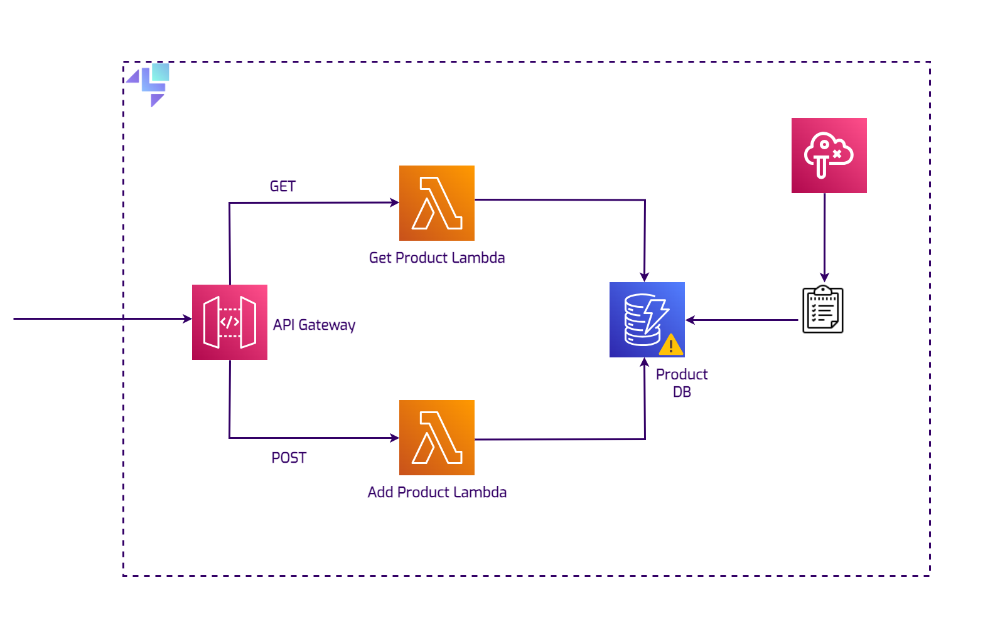

# Simulating outages for local cloud apps with LocalStack!

LocalStack's [Outages extension](https://pypi.org/project/localstack-extension-outages/) enables you to start a local outage, right on your developer machine. In this demo, we set up an HTTP CRUD API functioning as a Product Management System, and use the Outages extension to simulate an outage in the DynamoDB table. We'll further use `pytest` to test the application's behavior during the outage. For a more detailed walkthrough, check out our [Simulating Outages for Local Cloud Apps with LocalStack]() blog.

## Architecture



The architecture deploys:

-   A DynamoDB table named  `Products`.
-   Three Lambda functions:
    -   `add-product`  for product addition.
    -   `get-product`  for retrieving a product.
    -   `process-product-events`  for event processing and DynamoDB writes.
-   A locally hosted REST API named  `quote-api-gateway`.
-   SNS topic named  `ProductEventsTopic`  and SQS queue named  `ProductEventsQueue`.
-   API Gateway resource named  `productApi`  with additional  `GET`  and  `POST`  methods.

Additionally, the applications sets up a subscription between the SQS queue and SNS topic, along with an event source mapping between the SQS queue and the `process-product-events` Lambda function.

## Prerequisites

-   [LocalStack Docker image](https://docs.localstack.cloud/references/docker-images/#localstack-pro-image)  &  [`LOCALSTACK_AUTH_TOKEN`](https://docs.localstack.cloud/getting-started/auth-token/)
-   [Docker Compose](https://docs.docker.com/compose/install/)
-   [AWS CLI](https://docs.aws.amazon.com/cli/v1/userguide/cli-chap-install.html)  &  [`awslocal`  wrapper](https://docs.localstack.cloud/user-guide/integrations/aws-cli/#localstack-aws-cli-awslocal)
-   [Maven 3.8.5](https://maven.apache.org/install.html)  &  [Java 17](https://www.java.com/en/download/help/download_options.html)
-   [Python](https://www.python.org/downloads/)  &  [`pytest`  framework](https://docs.pytest.org/en/8.0.x/)
-   [`cURL`](https://curl.se/docs/install.html)

## Instructions

### Start your LocalStack container

Start your LocalStack container using the Docker Compose configuration:

```bash
export LOCALSTACK_AUTH_TOKEN=your_auth_token
docker-compose up
```

The Docker Compose configuration will:

* Install the Outages extension.
* Create your cloud infrastructure.
* Start the LocalStack container.

### Test the infrastructure

After a successful deployment, test the infrastructure by running the following commands:

```bash
curl --location 'http://12345.execute-api.localhost.localstack.cloud:4566/dev/productApi' \
--header 'Content-Type: application/json' \
--data '{
  "id": "prod-2004",
  "name": "Ultimate Gadget",
  "price": "49.99",
  "description": "The Ultimate Gadget is the perfect tool for tech enthusiasts looking for the next level in gadgetry. Compact, powerful, and loaded with features."
}'
```

The output will be:

```bash
Product added/updated successfully.
```

You can navigate to the [DynamoDB Resource Browser](https://app.localstack.cloud/inst/default/resources/dynamodb) to view the added product.

### Simulate an outage

You can simulate an outage in your local DynamoDB table by running the following command:

```bash
curl --location --request POST 'http://outages.localhost.localstack.cloud:4566/outages' \
  --header 'Content-Type: application/json' \
  --data '
  [
    {
      "service": "dynamodb",
      "region": "us-east-1"
    }
  ]'
```

The output will be:

```bash
[{"service": "dynamodb", "region": "us-east-1"}]
```

You can now test the infrastructure again by running the following command:

```bash
curl --location 'http://12345.execute-api.localhost.localstack.cloud:4566/dev/productApi' \
--header 'Content-Type: application/json' \
--data '{
  "id": "prod-1003",
  "name": "Super Widget",
  "price": "29.99",
  "description": "A versatile widget that can be used for a variety of purposes. Durable, reliable, and affordable."
}'
```

The following error will be displayed:

```bash
A DynamoDB error occurred. Message sent to queue.
```

### Stop the outage

To stop the outage, run the following command:

```bash
curl --location --request POST 'http://outages.localhost.localstack.cloud:4566/outages' \
  --header 'Content-Type: application/json' \
  --data '[]'
```

You can now see that the product has been added successfully by running the following command:

```bash
awslocal dynamodb scan --table-name Products
```

The following output will be displayed:

```bash
{
    "Items": [
        {
            "name": {
                "S": "Super Widget"
            },
            ...
        },
        {
            "name": {
                "S": "Ultimate Gadget"
            },
            ...
        }
    ],
    "Count": 2,
    "ScannedCount": 2,
    "ConsumedCapacity": null
}
```

### Running an integration test

To run an integration test, run the following command:

```bash
pytest
```

This command will test the application's behavior during an outage, and give you an instant validation that your architecture is resilient to outages.

## License

This code is licensed under the Apache 2.0 License.
